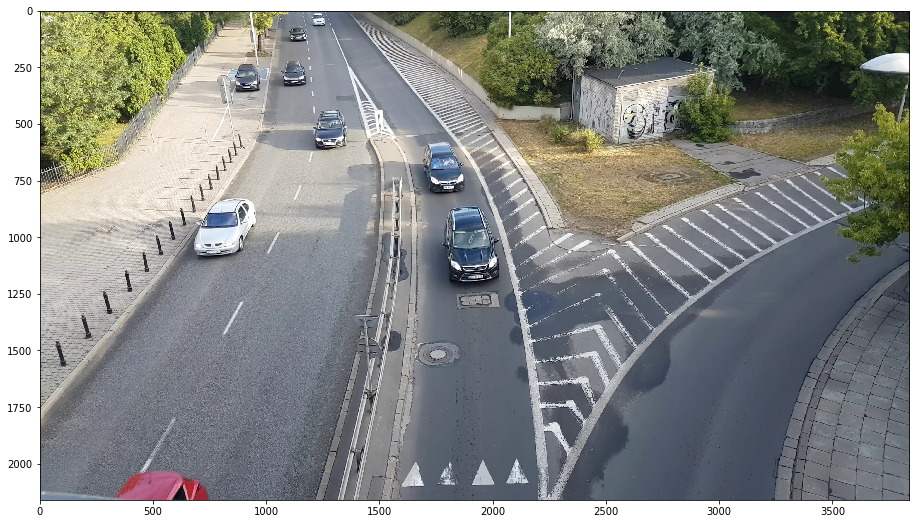

# Traffic Camera: Unwarp image

[In this notebook](TrafficCamera_Unwarp_Image.ipynb), you will learn how to easily unwarp images to get top-view!
The Unwarped image can be easier to analyze in some cases.

## Go to [TrafficCamera_Unwarp_Image.ipynb](TrafficCamera_Unwarp_Image.ipynb)

[](TrafficCamera_Unwarp_Image.ipynb)

## Imports

We will start by importing a few libraries:

```python
import matplotlib.pyplot as plt
import numpy as np
import cv2
```

## Download 4K Traffic Cam Video

You will need **youtube-dl** to download the video. (You can ignore this step but still, you will need a video

```bash
youtube-dl -f 313 MNn9qKG2UFI
```

## View first frame

We will use OpenCV and Matplotlib to view the very first frame:

```python
cap = cv2.VideoCapture("4K Traffic camera video - free download now!-MNn9qKG2UFI.webm")
while(True):
    ret, frame = cap.read()
    if not ret:
        break
    frame = cv2.cvtColor(frame,cv2.COLOR_BGR2RGB)
    break
```

```python
plt.figure(figsize=(16,9))
plt.imshow(frame)
plt.show()
```



## Define perspective with trapezoid

We will define a Region of Interest (ROI) by drawing a trapezoid on the image. The trapezoid should have two sides parallel to the straight segment of the road. In next step we will unwarp the image

Let's see the trapezoid!

```python
roi_corners=[[0.0 *frame.shape[1],1.0*frame.shape[0]], # left, down
             [0.38*frame.shape[1],0.0*frame.shape[0]], # left, up
             [0.62*frame.shape[1],0.0*frame.shape[0]], # right, up
             [1.0 *frame.shape[1],1.0*frame.shape[0]]] # right, down

show_roi=True
if show_roi:
    #change the format of points list and draw it on image
    src = np.float32(roi_corners)
    pts = np.array(src, np.int32)
    pts = pts.reshape((-1,1,2))
    cv2.polylines(frame,[pts],True,(255,0,0),10) # Red in RGB; width: 10
```

```python
plt.figure(figsize=(16,9))
plt.imshow(frame)
plt.show()
```


## The Unwarp function

We will use 4 point perspective transformation to transform our trapezoid into a rectangle.

We need to define destination of our four points in unwarped image -> new points should create a rectangle.

```python
def unwarp(img, roi_corners):
    '''
    Unwarp image using 4 points and getPerspectiveTransform
    '''
    src = np.float32(roi_corners)

    warped_size=(img.shape[1], img.shape[0])
    offset=int(warped_size[0]/3.0)
    dst = np.float32([[offset               , warped_size[1] ], #
                      [offset               , 0              ],
                      [warped_size[0]-offset, 0              ],
                      [warped_size[0]-offset, warped_size[1]]])

    Mpersp = cv2.getPerspectiveTransform(src, dst)
    warped = cv2.warpPerspective(img, Mpersp, dsize=warped_size)
    return warped
```

```python
# Unwarp the frame!
unwarped = unwarp(frame,roi_corners)
```

```python
# Let's see the result
plt.figure(figsize=(16,9))
plt.imshow(unwarped)
plt.show()
```


## Unwarp all 9184 frames!

Ok, so we know how to unwarp one frame, let's try to do it for all the frames in this video!

```python
cap = cv2.VideoCapture("4K Traffic camera video - free download now!-MNn9qKG2UFI.webm")
counter = 0
while(True):
    ret, frame = cap.read()
    if not ret:
        break

    # We are working in BGR which is native for OpenCV

    show_roi=True
    if show_roi:
        src = np.float32(roi_corners)

        pts = np.array(src, np.int32)
        pts = pts.reshape((-1,1,2))
        cv2.polylines(frame,[pts],True,(0,0,255),10) # Red in BGR

    # unwarp
    unwarped = unwarp(frame,roi_corners)

    #Picture in picture - show the original frame
    unwarped[-541:-1,0:960,:] = frame[::4,::4,:]

    #write the result to file!
    cv2.imwrite("/tmp/img%08d.jpg"%counter, unwarped)
    counter = counter + 1
```

## Create Video from files!

You will need **ffmpeg** to create a video from **.jpg** files

If you prefer H264 instead of H265 change libx265 to libx264. H265 will create smaller output file.

```bash
ffmpeg -pattern_type glob -i '/tmp/img*.jpg' -c:v libx265 result.mp4
```

## Share Your Results!

Fork this repo and share your results!
